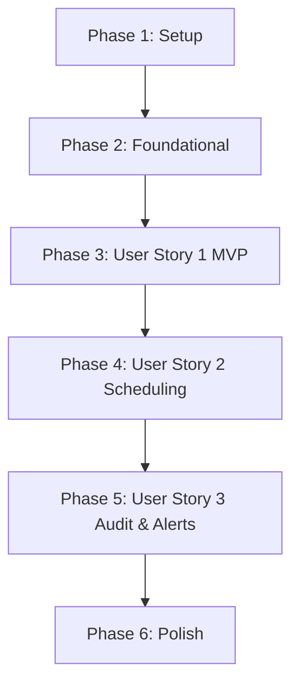

# Tasks: Supabase Instance Keep-Alive

**Input**: Design documents from `/specs/001-supabase-cron-keepalive/`

**Prerequisites**: [plan.md](plan.md) (required), [spec.md](spec.md) (required for user stories), [research.md](research.md), [data-model.md](data-model.md), [contracts/cli-contract.md](contracts/cli-contract.md)

**Tests**: Tests are included under the test runner configuration in plan.md using Jest and ts-jest.

**Organization**: Tasks are grouped by user story to enable independent implementation and testing of each story.

## Format: `[ID] [P?] [Story] Description`

- **[P]**: Can run in parallel (different files, no dependencies)
- **[Story]**: Which user story this task belongs to (US1, US2, US3)
- Contains exact file paths in descriptions.

---

## Phase 1: Setup (Shared Infrastructure)

**Purpose**: Project initialization and basic directory structure.

- [x] T001 Create project structure `src/` and `tests/` directories per plan.md
- [x] T002 Initialize Node.js TypeScript project, installing `pg`, `node-cron`, and `dotenv`
- [x] T003 [P] Configure TypeScript compiler settings in `tsconfig.json`
- [x] T004 [P] Configure testing environment via `jest.config.js`
- [x] T005 [P] Create and configure `.gitignore` to ensure `.env` and `logs/` are excluded

---

## Phase 2: Foundational (Blocking Prerequisites)

**Purpose**: Core configuration and logging infrastructure required before any user story can start.

**⚠️ CRITICAL**: No user story work can begin until this phase is complete.

- [x] T006 Create structured JSON and console logger in `src/logger.ts`
- [x] T007 Implement environment configuration loader and validator in `src/config.ts`
- [x] T008 Write unit tests for environment config parser in `tests/unit/config.test.ts`

**Checkpoint**: Foundation ready - config and logging verified, user story implementation can begin.

---

## Phase 3: User Story 1 - Configure and Execute Database Keep-Alive (Priority: P1) 🎯 MVP

**Goal**: Configure connection strings securely and perform a direct database ping (`SELECT 1;`) check on all Supabase instances.

**Independent Test**: Running the manual ping command (`npm run ping`) connects, pings both instances, and outputs success confirmations.

### Implementation for User Story 1

- [x] T009 [P] [US1] Create local `.env` configuration file containing placeholders for transaction pooler URLs
- [x] T010 [P] [US1] Implement database ping query runner function in `src/ping-worker.ts`
- [x] T011 [US1] Create manual execution CLI runner logic in `src/index.ts` to trigger a manual check
- [x] T012 [US1] Implement integration test in `tests/integration/ping.test.ts` to verify database connection and connection failures

**Checkpoint**: User Story 1 is fully functional. Run `npm run ping` to verify direct connection to both instances.

---

## Phase 4: User Story 2 - Automated Execution and Cron Scheduling (Priority: P2)

**Goal**: Automatically run keep-alive checks at standard periodic intervals (every 3 days) using `node-cron`.

**Independent Test**: Start the scheduler daemon (`npm start`), set the cron schedule to every 1 minute for test validation, and observe automated triggers.

### Implementation for User Story 2

- [x] T013 [US2] Implement scheduling coordinator daemon in `src/scheduler.ts` using `node-cron`
- [x] T014 [US2] Update application entry point `src/index.ts` to support both manual `ping` mode and scheduled daemon `start` mode
- [x] T015 [US2] Configure start commands `npm start` and `npm run ping` in `package.json`

**Checkpoint**: User Story 2 complete. Start the daemon with `npm start` and verify automated schedules execute successfully.

---

## Phase 5: User Story 3 - Detailed Audit Logging and Alerting on Failure (Priority: P3)

**Goal**: Log every execution in local `logs/keepalive.log` and emit standard error alerts on connection failure.

**Independent Test**: Simulate connection failure (e.g. wrong password), verify that JSON error is logged to `logs/keepalive.log` and standard error alert is triggered.

### Implementation for User Story 3

- [x] T016 [US3] Update log writer in `src/logger.ts` to support rotating files in `logs/keepalive.log`
- [x] T017 [US3] Integrate log appending into `src/ping-worker.ts` execution flow
- [x] T018 [US3] Add standard error stream alert emitters to `src/ping-worker.ts` and `src/index.ts` on connection retries and final failures

**Checkpoint**: User Story 3 complete. Confirm all pings write detailed JSON logs to `logs/keepalive.log` and connection errors alert immediately.

---

## Phase 6: Polish & Cross-Cutting Concerns

**Purpose**: Cleanup, formatting, running tests, and final documentation.

- [x] T019 Write setup and usage documentation in `README.md` at root
- [x] T020 [P] Clean up codebase, check formatting and run lint checks
- [x] T021 [P] Run all unit and integration tests successfully via `npm test`

---

## Dependencies & Execution Order

### Phase Dependencies

- **Phase 1 (Setup)**: No dependencies.
- **Phase 2 (Foundational)**: Depends on Phase 1. Blocks all user stories.
- **Phase 3 (User Story 1)**: Depends on Phase 2. MVP increment.
- **Phase 4 (User Story 2)**: Depends on Phase 3.
- **Phase 5 (User Story 3)**: Depends on Phase 4.
- **Phase 6 (Polish)**: Depends on all user story phases.

### Parallel Opportunities

- **Phase 1 Setup**: `T003`, `T004`, `T005` can run in parallel.
- **Phase 3 User Story 1**: `T009` (env file) and `T010` (worker script) can be built in parallel.
- **Phase 6 Polish**: `T020` and `T021` can run in parallel.

---

## Implementation Strategy

### MVP First (User Story 1 Only)

1. Complete **Setup** (Phase 1).
2. Complete **Foundational** (Phase 2).
3. Complete **User Story 1** (Phase 3).
4. **STOP and VALIDATE**: Run manual pings against test database credentials to confirm connectivity.

### Incremental Delivery

1. Add **User Story 2** -> verify that cron daemon schedules and triggers checks on time.
2. Add **User Story 3** -> check rotating JSON log writing under `logs/keepalive.log` and verify error alerting streams.
3. Complete **Polish** -> documentation and final test passes.
